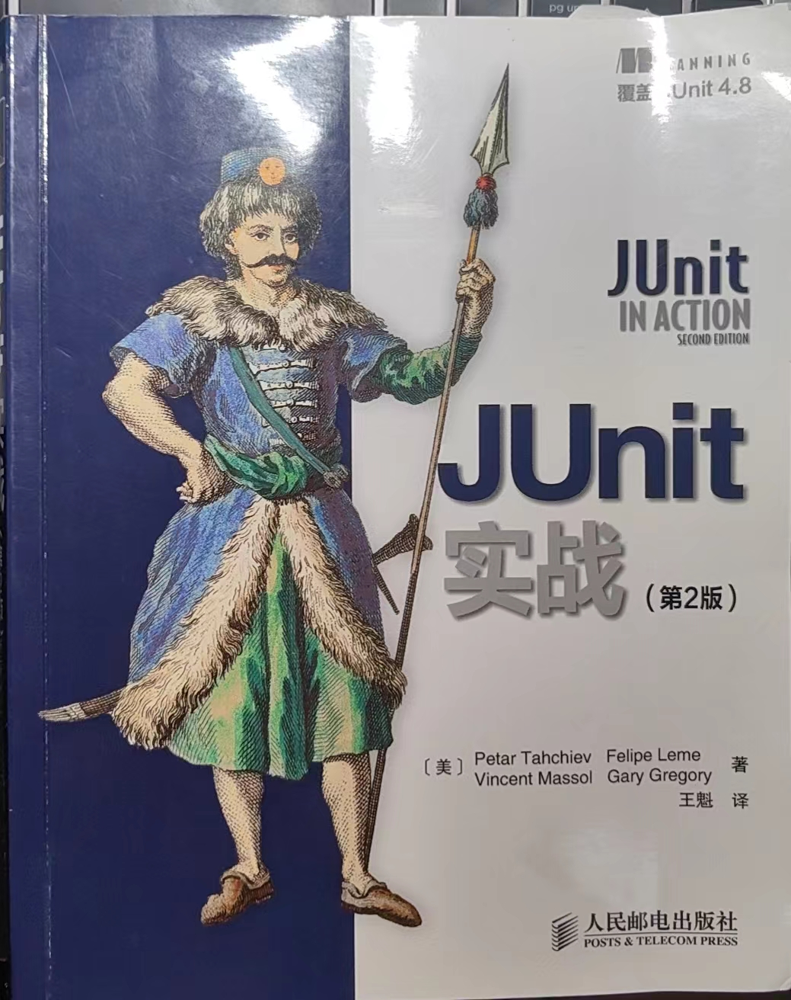

# JUnit IN Action(second edition)

## 第一章：JUnit起步

单元测试中的单元，指的是独立于其他单元的，实现单个功能的软件单元。也就是单元测试之间是独立的。

> API契约：一种观点，把API当做是在调用者于被调用者之间的正式协议。也就是一份由方法签名而生成的正式协议。方法需要它的调用者提供特定的对象引用或者原始类型数值，
> 然后返回一个对象引用或者原始数值。

**tips**：原书中的1.5、1.6两节，是原先IDEA等软件不支持junit，所以需要安装，还要配置classpath。实际现在的（2024版IDEA肯定是）idea已经支持junit了，所以这两节可以跳过。

## 第二章：探索JUnit的核心

实际主要描述了JUnit的一些核心概念。

- 测试单元：用@Test注解标注的方法。是独立的一个测试单元。
- 测试类：测试单元的集合。
- Assert：断言，自定义的测试条件。通过时候保持沉默，通不过的时候抛异常。
  - hamcrest：一个断言库，可以用来做测试。@see [Assertions](https://github.com/junit-team/junit4/wiki/Assertions)
- Runner：测试运行器，也就是实际实现测试的功能类。不同的测试运行器，可以满足不同的测试环境要求。
  - Parameterized：参数化测试运行器，可以运行多个测试用例。@see [ParameterizedTest](./src/test/java/cn/wh/study/chapter_02/ParameterizedTest.java)
  - JUnit支持自定义测试运行器。只需要继承@code org.junit.runner.Runner 即可。
- suite：测试套件，可以运行多个测试类。@see [SuiteTest](./src/test/java/cn/wh/study/chapter_02/SuiteTest.java)