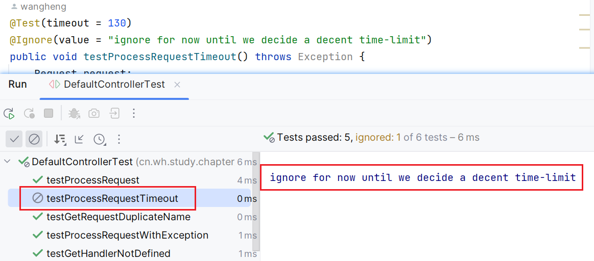

# JUnit IN Action(second edition)

## 第一章：JUnit起步

单元测试中的单元，指的是独立于其他单元的，实现单个功能的软件单元。也就是单元测试之间是独立的。

> API契约：一种观点，把API当做是在调用者于被调用者之间的正式协议。也就是一份由方法签名而生成的正式协议。方法需要它的调用者提供特定的对象引用或者原始类型数值，
> 然后返回一个对象引用或者原始数值。

**tips**：原书中的1.5、1.6两节，是原先IDEA等软件不支持junit，所以需要安装，还要配置classpath。实际现在的（2024版IDEA肯定是）idea已经支持junit了，所以这两节可以跳过。

## 第二章：探索JUnit的核心

实际主要描述了JUnit的一些核心概念。

- 测试单元：用@Test注解标注的方法。是独立的一个测试单元。
- 测试类：测试单元的集合。
- Assert：断言，自定义的测试条件。通过时候保持沉默，通不过的时候抛异常。
  - hamcrest：一个断言库，可以用来做测试。@see [Assertions](https://github.com/junit-team/junit4/wiki/Assertions)
- Runner：测试运行器，也就是实际实现测试的功能类。不同的测试运行器，可以满足不同的测试环境要求。
  - Parameterized：参数化测试运行器，可以运行多个测试用例。@see [ParameterizedTest](./src/test/java/cn/wh/study/chapter_02/ParameterizedTest.java)
  - JUnit支持自定义测试运行器。只需要继承@code org.junit.runner.Runner 即可。
- suite：测试套件，可以运行多个测试类。@see [SuiteTest](./src/test/java/cn/wh/study/chapter_02/SuiteTest.java)

### 第三章：掌握JUnit

主要介绍了主路径的测试最佳实践、异常测试、超时测试和Hamcrest匹配器。

#### 3.1 主路径测试

- 测试类用`xxxxTest`命名，如：`DefaultControllerTest`;测试单元用`testXxx`命名，如：`testGetHandlerNotDefined`
- `@Before`、`@After`会在每个单元测试前执行，多个的话顺序随机；`@BeforeClass`、`@AfterClass`在测试类执行前、测试类执行后执行，方法必须用`static`修饰，多个的话顺序随机。
- 一次只单元测试一个对象。但不需要测试对象的单个方法。最好是测试几个逻辑相关的方法。如：先`addHandler()`，再`getHandler()`,测试get的是否是add的handler。
- 已知的状态（如创建对象、获取资源），放在TestFixture里面。也就是测试前放在测试类的属性里面。
- 不要试图把多个测试塞到一个方法里。上诉的逻辑相关的方法，是为了让测试可行。在能设计出来可行的测试基础上，尽量细颗粒度的测试。
- 不要把测试单元设计成互相依赖的。如：测试单元A依赖测试单元B的结果，那么测试单元A的测试结果，会受测试单元B的影响。
- 单元测试的名称取详细些。多些一些注释。

#### 3.2 异常测试

- `@Test(expected = Exception.class)`，测试方法抛出指定异常，则测试通过。
- 异常测试更需要用明确的方法名、注释去明确异常的情况。
- 当你觉得测试分支路径太痛苦了，就说明代码设计的很糟糕。**如果代码难以测试，那么通常也难以使用**。

#### 3.3 超时测试

- `@Test(timeout = 1000)`，测试方法在指定时间内执行完，则测试通过。否则测试失败。单位ms。
- @Ignore(value = ""),可以忽略掉一些测试。效果如下图。
  - 
  
#### 3.4 Hamcrest匹配器

> Matchers that can be combined to create flexible expressions of intent.
> 可以组合以创建灵活的意图表达的匹配器

@see https://hamcrest.org/